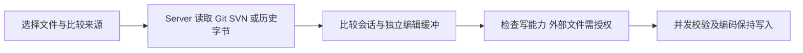

# 桌面、会话、工作区与网关

桌面 UI、Server 运行态、CLI 执行和文件磁盘状态分别有自己的权威来源。修改一条用户流程时，沿实际状态转移核验，不能只让某个组件显示预期文字。

## 桌面壳与重连

| 问题 | 当前入口 | 设计边界与修改约束 |
| --- | --- | --- |
| 原生能力从哪里进入 | `desktop/electron/preload.ts:25`：`contextBridge`；`desktop/src/lib/desktopHost/index.ts:25`：`getDesktopHost` | Renderer 通过 Host 合同访问 Electron 能力；browserHost 是降级实现 |
| 谁启动 Server | `desktop/electron/services/sidecarManager.ts:644`：`createServerPlan`，`:691`：`spawnSidecar`；`desktop/electron/services/serverRuntime.ts:231`：`startServerOnce` | 启动参数、进程生命周期、重复启动世代分别核验；控制地址与监听地址不相同 |
| 怎么重连 | `desktop/src/api/websocket.ts:68`：`onopen`，`:79`：`sync_state`；`src/server/ws/handler.ts:802`：同步处理 | 连接恢复还需要状态重放；重连不是创建新会话 |
| 断线是否停止任务 | `src/server/ws/handler.ts:843`：断开处理，`:865`：保留活跃 CLI；`src/server/ws/disconnectGraceConfig.ts` | 区分前台回合、后台任务、权限等待和空闲回收，不能断开即杀进程 |
| 为什么不能按文本去重 | `src/server/ws/handler.ts:3857`：replay UUID；`desktop/src/stores/chatStore.ts:5716`：`appendReplayedUserMessage` | 保留 `messageUuid`，同文本真实新消息不能被吞掉 |
| 模型下拉框是否就是执行态 | `src/server/ws/handler.ts:2327`：运行配置切换；`desktop/src/stores/chatStore.ts:3324`：`runtime_config_applied`；`desktop/src/stores/sessionRuntimeStore.ts:93` | UI 选择与 CLI 已应用值不同，必须处理成功、失败和回填 |

## 子代理活动如何展示

`src/server/ws/agentTaskState.ts:45` 区分后台任务、Agent 与非 Agent 任务和权威停止状态；`src/server/ws/handler.ts:4250` 转译任务进度；`desktop/src/stores/chatStore.ts:4478` 接收任务事件；`desktop/src/components/activity/sessionActivityModel.ts:773` 的 `buildSessionActivityModel` 汇总展示，`:113` 附近按 `toolUseId` 优先归并。

因此“主回复结束”“子 Agent 停止”“普通后台命令结束”不是同一个状态。当前工作区还有独立流进度链，见 [运行时地图](运行时地图.md)。不能用动画是否播放来推导执行是否仍在进行。

## 工作区：已超出 Git diff 查看器

| 职责 | 当前入口 | 不可丢掉的约束 |
| --- | --- | --- |
| 文件状态和来源 | `src/server/services/workspaceService.ts:549`：`getStatus`，`:606` SVN fallback，`:1096`：`getDiff` | Git 不可用不等于没有可用版本控制；类型名 `not_git_repo` 不能代替实际分支检查 |
| 比较两侧的来源 | `src/server/services/workspaceService.ts:1304`：`buildGitComparison`；`:1319`：`buildSvnComparison`；`:1477`：`readSvnBaseBytes` | 保留来源、revision 和原始字节；缓存/在途请求合并不能混淆版本身份 |
| 外部目录读取 | `src/server/services/workspaceService.ts:459`：`registerExternalRoot` | 仅增加查看器可读根；不改变会话工作目录、不授予递归写权限 |
| 单文件写授权 | `src/server/services/workspaceService.ts:519`：`grantExternalFileWriteAccess` | 按 session 和规范化文件身份授权，不能把目录可见性当写许可 |
| 写入冲突保护 | `src/server/services/workspaceService.ts:857`：`writeTextFile`，`:875` 串行写队列，`:1768`：`writeTextFileWithRawCas` | 有 expectedFingerprint 时比较原字节，否则比较 expectedContent；读到变化则 conflict。队列只串行本服务请求，不是跨进程原子 CAS 或文件锁 |
| 版本回退 | `src/server/services/workspaceService.ts:932`：`revertFile` | 内含真实 git restore / svn revert，属于数据变更，不是预览动作 |

前端核心：`desktop/src/components/workspace/workspaceComparisonSession.ts:147` 的 `createWorkspaceComparisonSession`、`:200` 的 `getWorkspaceComparisonCapability`、`:281` 的 `editWorkspaceComparisonSide`。比较计算在 `workspaceComparisonRuntime.ts` / `workspaceComparison.worker.ts`，显示在 `WorkspaceSideBySideDiffSurface.tsx`，面板协调在 `WorkspacePanel.tsx`。

**当前工作区重要修复**：`WorkspacePanel.tsx` 的 `handleRequestWriteAccess` 授权成功后更新原标签最新比较会话的写能力，保留内容、撤销历史和指纹。不能为了授权重新走 `getDiff` 重建比较：当前列表没有 diff，并不证明该文件不存在。此处是已读到的代码约束，本次没有重新执行该修复的历史测试。

工作区比较写入的编码类型是 auto / utf8 / gbk，需保持 UTF-8 BOM、GBK 与换行；其原字节写入路径遇到零字节会判 binary。通用工具读写链的 `src/utils/textEncoding.ts` 另有 UTF-16LE 支持，不能据此说工作区比较写入也支持它。比较显示成功不等于编码往返无损。

原字节校验与实际文件写入之间仍有时间窗口；外部进程可能在校验后写同一文件。因此这里是乐观并发保护，不是对所有外部写入竞争的绝对保证。

## 网关：配置成功不等于端到端成功

| 层次 | 当前入口 | 能证明与不能证明 |
| --- | --- | --- |
| Electron 凭据 | `desktop/electron/services/gatewayCredentials.ts:31`：`GatewayCredentials`；`:101`：`getAccessKey` | 主进程保管密钥；可用时 safeStorage 加密，否则只在内存保留 |
| 隧道进程 | `desktop/electron/services/gatewayTunnelRuntime.ts:61`：`GatewayTunnelRuntime`；`:273` stdin 传入秘密 | argv 与日志不要承载密钥；连接/鉴权状态不同于用户请求完整到达 |
| 转发凭据 | `src/server/middleware/gatewayForwarderAuth.ts:43`：`isGatewayForwarderAuthorized`；`:53`：`isGatewayForwarderRestrictedPath` | 转发会话权限不能自动变成控制面权限 |
| 本机部署控制面 | `src/server/localGatewaySetup.ts:18`：`LocalGatewaySetup`；`:116` 会话 Cookie | 独立部署模式也必须鉴权；不能照官网默认 loopback 信任套用 |

`gatewayTunnelRuntime.ts:191` 明确输出 `endToEndVerified: false`。地图只说明架构边界，不证明当前鉴权实现没有漏洞，也不替代独立网关项目的验收。本次没有连接真实网关、处理密钥或更改用户配置。

## 邻近测试与实际验收边界

- 会话与重放：`src/server/__tests__/websocket-handler.test.ts`、`desktop/src/api/websocket.test.ts`、`desktop/src/stores/chatStore.test.ts`、`desktop/src/stores/chatStore.golden.test.ts`。
- 工作区：`src/server/__tests__/workspace-service.test.ts`；`desktop/src/components/workspace/workspaceComparisonSession.test.ts`、`workspaceComparisonRuntime.test.ts`、`WorkspacePanel.test.tsx`、`WorkspaceSideBySideDiffSurface.test.tsx`。
- 网关：`desktop/electron/services/gatewayCredentials.test.ts`、`gatewayTunnelRuntime.test.ts`；`src/server/__tests__/gateway-forwarder-auth.test.ts`、`local-gateway-setup.test.ts`、`local-gateway-security-independent.test.ts`。

本次均未运行产品测试，只核对路径、代码和测试描述。Electron 主进程不在 `desktop/src` 的覆盖率范围，前端绿灯不能替代主进程和真实用户流程验收。

## 2026-09-09 补充：提交到更新日志

新增链路：`scripts/release-changelog.ts` 从已发布祖先版本之后的提交生成通俗中文说明 → 工作流分发同一份数据 → 打包器写入自动更新数据，前端构建嵌入包内说明 → `AboutSettings.tsx` 分别展示待安装版本和当前版本的改动。顶部更新日志入口定位到包内说明；`getPackagedChangelog` 校验当前版本号，避免把其他版本说明显示为当前版本。旧包未带日志时明确显示缺失提示。

设计、范围和脚本用法见 [更新日志生成说明](../release-notes/README.md)。此节取代原先关于页面仅跳转发布列表的行为描述；前文历史快照的验收边界保持不变。新增证据入口：`scripts/release-changelog.test.ts`、`desktop/src/pages/settings/AboutSettings.test.tsx`。真实安装升级须另验，不能用组件状态测试替代。

### 2026-09-10：包内历史更新记录

`AboutSettings` 接入独立 `ChangelogHistory`，在应用内搜索、展开历史版本。`scripts/changelog-history.ts` 校验并合并 `release-notes/history.json` 和已发布归档；生成器把历史写入 `changelog.json`，两条发布工作流上传该附件供后续版本沿用。`desktop/scripts/packaged-changelog.ts` 将有效历史交给前端构建嵌入，离线阅读不依赖网站。
