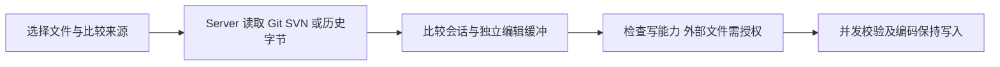

# 桌面、会话、工作区与网关

桌面 UI、Server 运行态、CLI 执行和文件磁盘状态分别有自己的权威来源。修改一条用户流程时，沿实际状态转移核验，不能只让某个组件显示预期文字。

## 桌面壳与重连

### 输出中的发送与停止入口

`ChatInput.tsx` 的 `hasComposerContent` 按非空白文字、附件或工作区引用判断草稿是否有内容；`showStopAction` 仅在普通会话运行中且无内容时显示停止。按钮的图标、名称、点击动作和禁用状态使用同一判定，不能直接用运行状态覆盖发送入口，也不能用工作目录是否可用来决定切换成停止。

点击发送仍走 `handleSubmit` → `queueUserMessage`；运行中保留排队卡片，由“立即引导”或回合结束后的调度发送。移动端使用相同逻辑并保留 44×44 像素触摸目标。`ChatInput.test.tsx` 覆盖桌面／手机点击、排队／引导／结束后发送、清空停止、纯附件／引用与目录不可用边界。浏览器核验使用隔离配置与模拟运行时，不代表真实模型或实体手机验收。

| 问题 | 当前入口 | 设计边界与修改约束 |
| --- | --- | --- |
| 原生能力从哪里进入 | `desktop/electron/preload.ts:25`：`contextBridge`；`desktop/src/lib/desktopHost/index.ts:25`：`getDesktopHost` | Renderer 通过 Host 合同访问 Electron 能力；browserHost 是降级实现 |
| 谁启动 Server | `desktop/electron/services/sidecarManager.ts:644`：`createServerPlan`，`:691`：`spawnSidecar`；`desktop/electron/services/serverRuntime.ts:231`：`startServerOnce` | 启动参数、进程生命周期、重复启动世代分别核验；控制地址与监听地址不相同 |
| 怎么重连 | `desktop/src/api/websocket.ts:68`：`onopen`，`:79`：`sync_state`；`src/server/ws/handler.ts:802`：同步处理 | 连接恢复还需要状态重放；重连不是创建新会话 |
| 断线是否停止任务 | `src/server/ws/handler.ts:843`：断开处理，`:865`：保留活跃 CLI；`src/server/ws/disconnectGraceConfig.ts` | 区分前台回合、后台任务、权限等待和空闲回收，不能断开即杀进程 |
| 为什么不能按文本去重 | `src/server/ws/handler.ts:3857`：replay UUID；`desktop/src/stores/chatStore.ts:5716`：`appendReplayedUserMessage` | 保留 `messageUuid`，同文本真实新消息不能被吞掉 |
| 模型下拉框是否就是执行态 | `src/server/ws/handler.ts:2327`：运行配置切换；`desktop/src/stores/chatStore.ts:3324`：`runtime_config_applied`；`desktop/src/stores/sessionRuntimeStore.ts:93` | UI 选择与 CLI 已应用值不同，必须处理成功、失败和回填 |

## 子代理活动如何展示

`src/server/ws/agentTaskState.ts:45` 区分后台任务、Agent 与非 Agent 任务和权威停止状态；`src/server/ws/handler.ts:4250` 转译任务进度；`desktop/src/stores/chatStore.ts:4478` 接收任务事件；`desktop/src/components/activity/sessionActivityModel.ts:773` 的 `buildSessionActivityModel` 汇总展示，`:113` 附近按 `toolUseId` 优先归并。

因此“主回复结束”“子 Agent 停止”“普通后台命令结束”不是同一个状态。当前工作区还有独立流进度链，见 [运行时地图](运行时地图.md)。不能用动画是否播放来推导执行是否仍在进行。

## 工作区：已超出 Git diff 查看器

| 职责 | 当前入口 | 不可丢掉的约束 |
| --- | --- | --- |
| 文件状态和来源 | `src/server/services/workspaceService.ts:549`：`getStatus`，`:606` SVN fallback，`:1096`：`getDiff` | Git 不可用不等于没有可用版本控制；类型名 `not_git_repo` 不能代替实际分支检查 |
| 比较两侧的来源 | `src/server/services/workspaceService.ts:1304`：`buildGitComparison`；`:1319`：`buildSvnComparison`；`:1477`：`readSvnBaseBytes` | 保留来源、revision 和原始字节；缓存/在途请求合并不能混淆版本身份 |
| 外部目录读取 | `src/server/services/workspaceService.ts:459`：`registerExternalRoot` | 仅增加查看器可读根；不改变会话工作目录、不授予递归写权限 |
| 单文件写授权 | `src/server/services/workspaceService.ts:519`：`grantExternalFileWriteAccess` | 按 session 和规范化文件身份授权，不能把目录可见性当写许可 |
| 写入冲突保护 | `src/server/services/workspaceService.ts:857`：`writeTextFile`，`:875` 串行写队列，`:1768`：`writeTextFileWithRawCas` | 有 expectedFingerprint 时比较原字节，否则比较 expectedContent；读到变化则 conflict。队列只串行本服务请求，不是跨进程原子 CAS 或文件锁 |
| 版本回退 | `src/server/services/workspaceService.ts:932`：`revertFile` | 内含真实 git restore / svn revert，属于数据变更，不是预览动作 |

前端核心：`desktop/src/components/workspace/workspaceComparisonSession.ts:147` 的 `createWorkspaceComparisonSession`、`:200` 的 `getWorkspaceComparisonCapability`、`:281` 的 `editWorkspaceComparisonSide`。比较计算在 `workspaceComparisonRuntime.ts` / `workspaceComparison.worker.ts`，显示在 `WorkspaceSideBySideDiffSurface.tsx`，面板协调在 `WorkspacePanel.tsx`。

**当前工作区重要修复**：`WorkspacePanel.tsx` 的 `handleRequestWriteAccess` 授权成功后更新原标签最新比较会话的写能力，保留内容、撤销历史和指纹。不能为了授权重新走 `getDiff` 重建比较：当前列表没有 diff，并不证明该文件不存在。此处是已读到的代码约束，本次没有重新执行该修复的历史测试。

工作区比较写入的编码类型是 auto / utf8 / gbk，需保持 UTF-8 BOM、GBK 与换行；其原字节写入路径遇到零字节会判 binary。通用工具读写链的 `src/utils/textEncoding.ts` 另有 UTF-16LE 支持，不能据此说工作区比较写入也支持它。比较显示成功不等于编码往返无损。

原字节校验与实际文件写入之间仍有时间窗口；外部进程可能在校验后写同一文件。因此这里是乐观并发保护，不是对所有外部写入竞争的绝对保证。

## 网关：配置成功不等于端到端成功

| 层次 | 当前入口 | 能证明与不能证明 |
| --- | --- | --- |
| Electron 凭据 | `desktop/electron/services/gatewayCredentials.ts:31`：`GatewayCredentials`；`:101`：`getAccessKey` | 主进程保管密钥；可用时 safeStorage 加密，否则只在内存保留 |
| 隧道进程 | `desktop/electron/services/gatewayTunnelRuntime.ts:61`：`GatewayTunnelRuntime`；`:273` stdin 传入秘密 | argv 与日志不要承载密钥；连接/鉴权状态不同于用户请求完整到达 |
| 转发凭据 | `src/server/middleware/gatewayForwarderAuth.ts:43`：`isGatewayForwarderAuthorized`；`:53`：`isGatewayForwarderRestrictedPath` | 转发会话权限不能自动变成控制面权限 |
| 本机部署控制面 | `src/server/localGatewaySetup.ts:18`：`LocalGatewaySetup`；`:116` 会话 Cookie | 独立部署模式也必须鉴权；不能照官网默认 loopback 信任套用 |

`gatewayTunnelRuntime.ts:191` 明确输出 `endToEndVerified: false`。地图只说明架构边界，不证明当前鉴权实现没有漏洞，也不替代独立网关项目的验收。本次没有连接真实网关、处理密钥或更改用户配置。

## 邻近测试与实际验收边界

- 会话与重放：`src/server/__tests__/websocket-handler.test.ts`、`desktop/src/api/websocket.test.ts`、`desktop/src/stores/chatStore.test.ts`、`desktop/src/stores/chatStore.golden.test.ts`。
- 工作区：`src/server/__tests__/workspace-service.test.ts`；`desktop/src/components/workspace/workspaceComparisonSession.test.ts`、`workspaceComparisonRuntime.test.ts`、`WorkspacePanel.test.tsx`、`WorkspaceSideBySideDiffSurface.test.tsx`。
- 网关：`desktop/electron/services/gatewayCredentials.test.ts`、`gatewayTunnelRuntime.test.ts`；`src/server/__tests__/gateway-forwarder-auth.test.ts`、`local-gateway-setup.test.ts`、`local-gateway-security-independent.test.ts`。

本次均未运行产品测试，只核对路径、代码和测试描述。Electron 主进程不在 `desktop/src` 的覆盖率范围，前端绿灯不能替代主进程和真实用户流程验收。

## 2026-09-09 补充：提交到更新日志

新增链路：`scripts/release-changelog.ts` 从已发布祖先版本之后的提交生成通俗中文说明 → 工作流分发同一份数据 → 打包器写入自动更新数据，前端构建嵌入包内说明 → `AboutSettings.tsx` 分别展示待安装版本和当前版本的改动。顶部更新日志入口定位到包内说明；`getPackagedChangelog` 校验当前版本号，避免把其他版本说明显示为当前版本。旧包未带日志时明确显示缺失提示。

设计、范围和脚本用法见 [更新日志生成说明](../release-notes/README.md)。此节取代原先关于页面仅跳转发布列表的行为描述；前文历史快照的验收边界保持不变。新增证据入口：`scripts/release-changelog.test.ts`、`desktop/src/pages/settings/AboutSettings.test.tsx`。真实安装升级须另验，不能用组件状态测试替代。

## 2026-09-09 横向比较与保存刷新定位补充

- `workspaceAlignmentSolver.ts::advancedInterval` 的精确匹配区间先筛选含文字/数字/标识符的内容行；空行和纯标点仍参与局部比较，但不再独自切开相似函数。快档与人工锚点保持原语义。
- `WorkspacePanel.tsx::saveComparisonTabs` 接受保存结果，`onSave` 随后调用 `openPreview(force)`；`workspacePanelStore.ts::requestWorkspacePreviewPayload` 在 force 时不回填保存前缓存，等待期间保留当前会话。
- `workspaceComparisonRuntime.ts::comparisonInputCacheKey` 采用实际内容身份；原始字节指纹和局部 revision 不能唯一标识编辑缓冲。相同内容可共享在途/已完成结果，响应 revision 按各调用者返回。
- 证据：本轮 6 文件 221 项定向测试通过；桌面代码检查和独立构建通过。全量桌面/聊天契约仍有失败，未声称全量完成，未提交/推送/发布。来源为私人任务 `2026-09-09-cc-haha-diff-alignment-save`；截图原始双文件未取得，复现的是相同类型问题。

- 最终补充：`WorkspaceSideBySideDiffSurface.tsx` 的高亮 effect 在 recomputing 时不发请求，防止把旧 sourceFiles 缓存到新输入身份。最终 223 项定向通过，真实浏览器模拟刷新等待 5 秒验证可见文字与编辑值一致；lint/build 通过；定向四生产文件行覆盖率 95.78%，全仓门禁仍失败。

### 2026-09-10：包内历史更新记录

`AboutSettings` 接入独立 `ChangelogHistory`，在应用内搜索、展开历史版本。`scripts/changelog-history.ts` 校验并合并 `release-notes/history.json` 和已发布归档；生成器把历史写入 `changelog.json`，两条发布工作流上传该附件供后续版本沿用。`desktop/scripts/packaged-changelog.ts` 将有效历史交给前端构建嵌入，离线阅读不依赖网站。

## 2026-09-15：服务商模型目录启动刷新

KSCC 目录此前仅在授权时获取。现在 AppShell 在服务就绪后后台调用 providerStore.fetchProviders；服务端列表返回支持目录刷新的 provider ID，store 每个客户端生命周期自动刷新一次（2026-09-16 起扩展为“每次打开模型列表也后台刷新一次”，见下文），KSCC 设置卡可手动重试。POST /api/providers/:id/refresh-models 经 ProviderIntegration.fetchModelCatalog 调用 KSCC /cli/models。

ProviderService 在远端请求外合并并发，写入前重新读取并校验 provider 身份/凭据，以按配置目录串行事务更新目录及失效默认映射；刷新不激活服务商、不发送会话切换。活动服务商的能力 settings 同步供后续启动使用。异常/空/不完整目录保留旧值；合法非空目录全量替换、去重，支持增删。ModelSelector 对已成功刷新后仍选着下架模型的历史会话提示重选，不中途改其运行选择。

回归入口：src/server/__tests__/provider-model-refresh.test.ts、desktop/src/providerBusinesses/kscc/modelRefresh.test.tsx、AppShell.test.tsx。当前源码定向测试和前端构建已验证；不代表已安装的新版本或真实 KSCC 推理兼容。

### 同日扩展：Seasun Token Hub 模型同步

Seasun 也通过同一 fetchModelCatalog 钩子参与启动刷新。完整目录仍从固定 AI Manager `/api/v1/auth/me/api-key` 获取，按 clients/capabilities 筛选编程模型并保存各自的 Anthropic、Responses 或 Chat 调用协议；不根据模型名称猜测协议，不用未验证的网关目录替代。

登录交换获得的管理端 access/refresh token 独立存入后端 `provider-integrations/seasun-credentials.json`（版本 1），与 providerId 和模型密钥摘要绑定，不进入 provider 数据或登录状态响应。旧版缺少此文件时保留原配置、明确要求一次重新连接，这是该新增认证状态的向前兼容路径。普通 HTTP 401 最多续期一次，先持久化轮换凭据再重试；明确要求 SSO 重连、缺少续期令牌或续期认证失败时提示重连。无权限的新账号连接会清理旧账号刷新凭据，保留已有模型缓存。

Seasun 设置面板区分“刷新状态”和“刷新模型”，展示更新时间及重连提示。成功重新连接后重试此前失败的同步。多 provider 并发刷新时，客户端等待最新列表请求的实际结果，避免较早请求被取代而误报失败。

新增回归：`src/server/__tests__/seasun-model-refresh.test.ts`、`desktop/src/providerBusinesses/seasun/SeasunLoginPanel.test.tsx`。使用临时配置及模拟接口验证登录→持久化→新服务刷新、模型增删及协议、续期轮换、旧授权、并发、失败缓存和身份边界；没有调用真实模型或用户账号。

## 2026-09-16：打开模型列表时的后台目录刷新

端到端行为从“仅启动刷新一次”扩展为“每次打开模型选择下拉都后台刷新一次”：`ModelSelector` 在 `open` 为真且 runtime scoped 时调用 `providerStore.refreshModelCatalogsOnPickerOpen()`，面板始终先用 `providers[].modelCatalog` 缓存渲染，不等待刷新、不阻塞选择。

`providerStore` 保存服务端 `GET /api/providers` 返回的 `modelRefreshProviderIds`；打开触发的刷新对同一 provider 有 60 秒最小间隔（`PICKER_REFRESH_INTERVAL_MS`），在途刷新（含启动那次自动刷新）直接跳过且不推进节流时间，设置页手动刷新按钮不受节流限制。刷新沿用既有 `refreshModelCatalog` 链路：成功回写缓存并供下次打开显示，失败只更新 `modelRefreshStatus.failed`、保留最后一次同步的缓存。服务端未改动；登录 activate 时的 cache、会话选择保护不变。

回归入口：`desktop/src/providerBusinesses/kscc/modelRefresh.test.tsx`。定向 79 项通过，桌面 lint（eslint + tsc --noEmit）与 build 退出码 0，provider-contract 20 suites 通过；`ChatInput`/`pages` 的 29 项失败经基线回退核对为工作树既有问题。未做真机与真实 KSCC 验证。

## 2026-09-16：长会话回看时保持阅读位置

`MessageList.captureReadingAnchor` 记录首个可见消息及其屏幕偏移；虚拟列表回填高度、调整占位区后，在布局提交阶段补偿同一消息的位置差，同时保留期间用户的滚动。会话切换、回到最新、显式导航和搜索会清除旧锚点。补偿只写原生滚动位置，由后续 scroll 事件更新虚拟窗口，避免在测量尚未完成时同步重入渲染。

`MeasuredRenderItem` 通过 flow-root 包含子元素外边距，保留真实浮点高度；48～24000px 的上下限仅用于估算，不能截断实际测量。浏览器自动锚定继续关闭，避免两套补偿竞争。

回归入口：`desktop/src/components/chat/MessageList.test.tsx`，覆盖上方消息变高/变矮、短行真实高度和后续用户滚动。历史副本滚轮实验中，修复前额外位移最大 680.75px；修复后 12 次上滚、6 次下滚、35 次布局变化，额外位移最大 0.25px；对话导航与回到最新正常。该实验使用真实历史的只读副本，不包含私人历史内容，也不代表所有显示缩放或安装版均已验收。

## 2026-09-16：本地累积修复整合

- 本次汇总尚未入主干的活动面板、历史子任务、文件链接定位、差异保存与文件编辑修复，并保留主干已有模型刷新、网关和滚动修复。
- 原生浏览器由 BrowserSurface 观察 DOM 模态对话框的实际存在来控制遮挡；通用 Modal 不再直接依赖桌面状态仓库。显式遮挡登记仍用于其他覆盖层。
- 浏览器与通用弹窗及活动页定向回归 189 项通过；全量旧失败单独记录于本机验证产物，不把生产构建成功当作全量回归通过。
