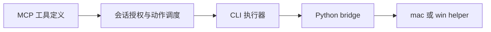

# 电脑操作：当前实现与官网新增方案

当前 fork 的电脑操作由 TypeScript 授权调度和 Python 平台 helper 承接。官网新增 7 篇偏向原生 macOS 的方案/评审，适合作为后续研究资料，不能当作当前 Windows fork 的实现说明。

## 当前真实路径

| 职责 | 当前路径与符号 | 修改时要保持什么 |
| --- | --- | --- |
| 工具名称、参数与坐标说明 | `src/vendor/computer-use-mcp/tools.ts`：`buildComputerUseTools` | 暴露的工具与 capability、动作分发一致 |
| 授权与会话绑定 | `src/vendor/computer-use-mcp/toolCalls.ts`、`mcpServer.ts` | 应用授权、动作权限、坐标参考是会话状态 |
| CLI 执行器 | `src/utils/computerUse/executor.ts:111`：`createCliExecutor` | 所有具体输入/截图经统一执行器；不要绕开授权直接调用 helper |
| Python 运行时 | `src/utils/computerUse/pythonBridge.ts:117`：`ensureBootstrapped`；`:159`：`callPythonHelper` | helper、依赖和 JSON 协议匹配；隔离用户运行目录做测试 |
| 平台能力 | `src/utils/computerUse/common.ts:59`：`getCliComputerUseCapabilities` | 能力声明：macOS 为 `native` 截图过滤，Windows 为 `none`；输入许可不等于截图过滤，声明不代替真机验证 |
| 配置与坐标 | `src/utils/computerUse/gates.ts:11`：`DEFAULTS`；`:52`：`getChicagoCoordinateMode` | `pixelValidation` 默认 false；坐标模式首次读取后冻结，描述与执行保持一致 |
| 实际系统调用 | `runtime/mac_helper.py`、`runtime/win_helper.py` | 分平台核验，不能从 macOS 方案推断 Windows 行为 |

**占位反证**：`src/utils/computerUse/swiftLoader.ts:1` 的 `requireComputerUseSwift()` 直接抛错，明确已由 Python bridge 替代。本次检查仓库根也不存在官网方案中的 `native/cu-helper/`。因此不可把新增文档中的 Swift 类名作为当前代码地图入口。

本地 [computer-use.md](../docs/internals/computer-use.md) 与本次官网正文相同，已明确默认像素陈旧检查关闭、无全局 Escape、不会自动隐藏窗口等限制。应沿实际代码复查，不能因配置中出现 `hideBeforeAction: true` 就承诺隐私隔离。

## 新增资料最值得吸收的三个判断

以下是**来源提出的设计或评审意见**，不是本次独立证实的第三方产品内部实现，也不是要求现在改造本 fork。

1. **把“读状态”和“执行动作”的接口明确分开。** 早期 blueprint / handoff 主张动作后自动重新截图；后续 parity-review 反过来主张无隐式快照、动作前活体解析。可借鉴的是让调用成本、状态刷新时机和陈旧元素处理成为明确契约；不能把两套互斥方案同时写进需求。
2. **元素身份必须重新验证，不能把旧序号永远当成当前控件。** 后续评审强调动作时根据路径/窗口/角色重新确认对象。这个判断可用于任何 UI 自动化方案，但当前像素工具和新 AX 元素树方案需要分别实现与测试。
3. **“没有找到某符号”不能证明“不使用某能力”。** 早期材料依据静态符号声称只有 AX（系统辅助功能接口）语义动作；后续 CEF 注入分析承认该结论不成立。我们保留纠错链，不把第三方逆向猜测当成原始设计事实。

对应来源：[blueprint](来源/2026-09-09/computer-use-codex-impl-blueprint.md)、[handoff](来源/2026-09-09/computer-use-handoff.md)、[parity-review](来源/2026-09-09/computer-use-codex-parity-review.md)、[CEF 注入分析](来源/2026-09-09/computer-use-cef-injection.md)。来源 URL、抓取时间和 HTTP Last-Modified 在 [manifest](来源/2026-09-09/manifest.json)；设计/评审日期以正文自述为准，HTTP 修改时间不是设计发生时间。文中的外部 worktree、设备路径、指令和验收数字属于原始资料，不能在本机直接执行或宣称复现。

## 将来确实要迁入时从哪里验证

先定义所需平台、工具协议、授权边界和状态/截图刷新规则，再做最小实机试验；Swift 方案只解决 macOS 路径，Windows 需要自己的对应实现。当前 fork 相关测试入口包括：

- `src/vendor/computer-use-mcp/toolCalls.security.test.ts`：工具安全调度。
- `src/utils/computerUse/common.test.ts`、`gates.test.ts`、`permissions.test.ts`：平台能力、开关与权限。
- `src/server/__tests__/computer-use-api.test.ts`、`computer-use-python.test.ts`：配置/API/Python 路径。
- `desktop/src/pages/ComputerUseSettings.test.tsx`：设置页。

这些测试本次没有运行。电脑操作原理核查也没有控制任何用户窗口、安装 Python 依赖或修改系统授权。
